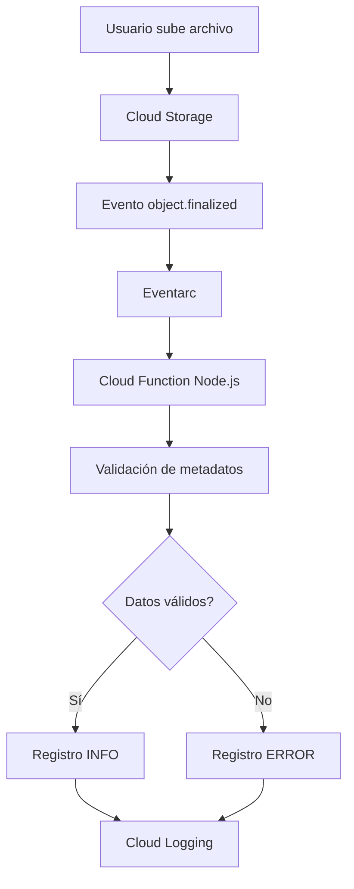

# Arquitectura propuesta — Día 1

```mermaid
flowchart TD
    A[Usuario sube archivo] --> B[Cloud Storage]
    B --> C[Evento object.finalized]
    C --> D[Eventarc]
    D --> E[Cloud Function Node.js]
    E --> F[Validación de metadatos]
    F --> G{Datos válidos?}
    G -->|Sí| H[Registro INFO]
    G -->|No| I[Registro ERROR]
    H --> J[Cloud Logging]
    I --> J
```

**Estado:** arquitectura propuesta, pendiente de despliegue.

La lógica de la Cloud Function se probó localmente
mediante Functions Framework y eventos simulados.
